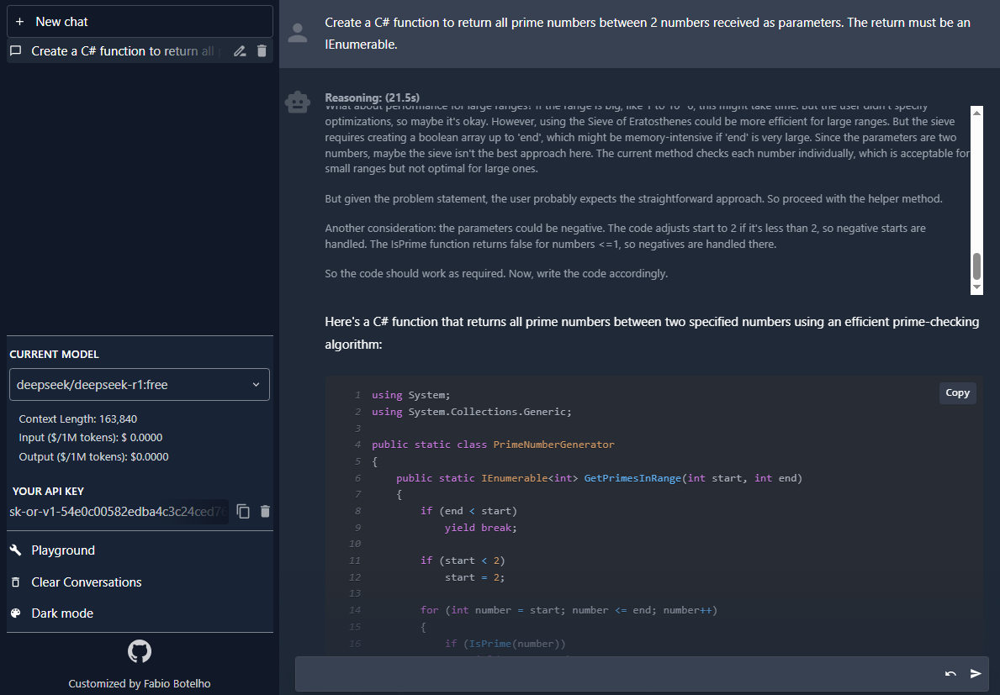
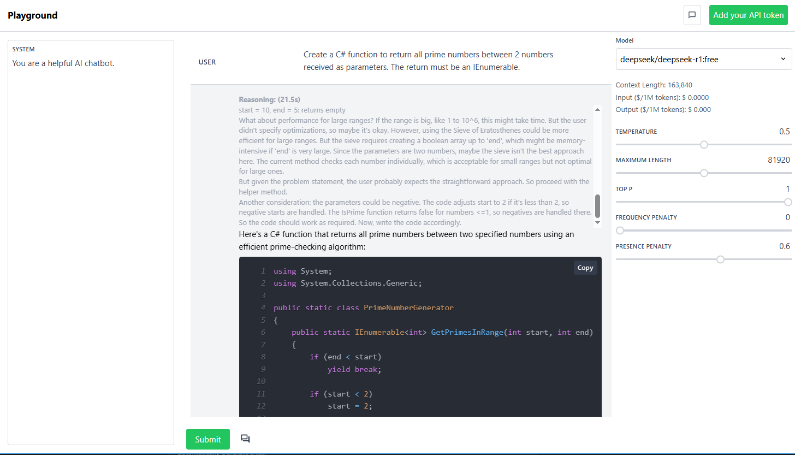

# OpenRouter Playground

Just got your OpenRouter API Key and want to give it a spin? Look not further! This project is mainly targeted to allow you to test out your OpenRouter API keys. The current OpenRouter Playground supports the new reasoning o1 models (without showing their thinking process). This project should fix both of those issues without comprimising on either experience. The project aims to preserve as much of the vanilla experience as possible while also providing a link between the the playground and ChatGPT to enable a better developer experience.

As a side note, all API keys are encrypted and stored in your browser's local storage, so you can use this project without having to worry about your API key being stolen.

## Demo

### Mock ChatGPT Environment
This environment has most of the critical features like conversation history (which is stored locally), prompting, and multiple conversations. This environment is a great way to test out your API key and see how it works!


### Playground Environment


## Running Locally
To run this project locally, you will need to have [Node.js](https://nodejs.org/en/) installed. Once you have Node.js installed, you can clone this repository and run the following commands:

```bash
cd openrouter-playground
yarn install
yarn dev
```

This will start a local server on port 3000. You can then navigate to `localhost:3002` to view the project!

