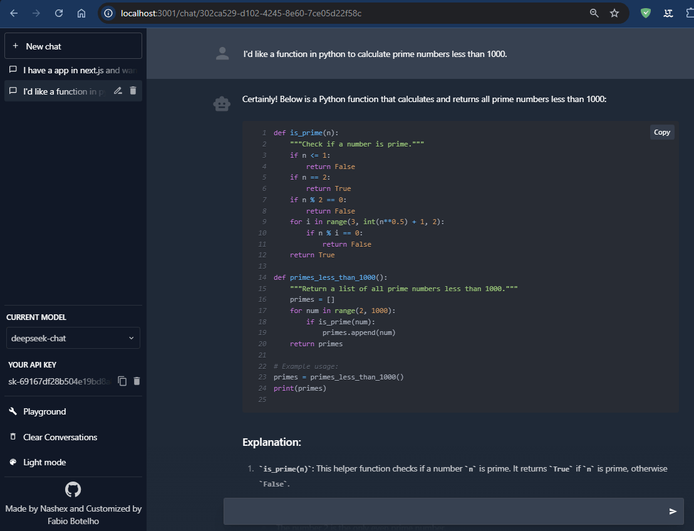
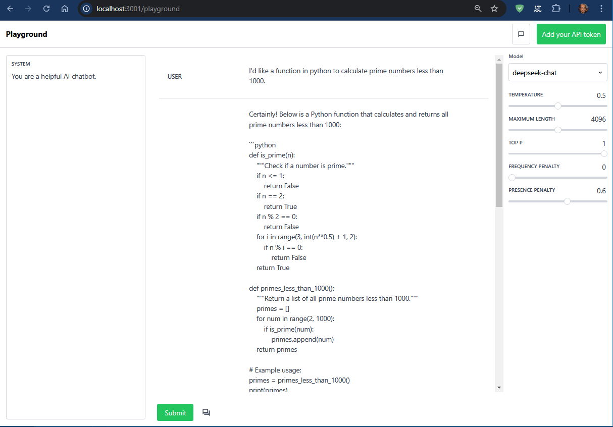

# DeepSeek Playground

Just got your DeepSeek API Key and want to give it a spin? Look not further! This project is mainly targeted to allow you to test out your Open AI API keys. The current DeepSeek Playground supports the DeepSeek V3 and the new reasoning model DeepSeek-R1 (without showing the thinking process). The project aims to preserve as much of the vanilla experience as possible while also providing a link between the the playground and DeepSeek to enable a better developer experience.

As a side note, all API keys are encrypted and stored in your browser's local storage, so you can use this project without having to worry about your API key being stolen.

## Demo

### Mock DeepSeekGPT Environment
This environment has most of the critical features like conversation history (which is stored locally), prompting, and multiple conversations. This environment is a great way to test out your API key and see how it works!


### Playground Environment


## Running Locally
To run this project locally, you will need to have [Node.js](https://nodejs.org/en/) installed. Once you have Node.js installed, you can clone this repository and run the following commands:

```bash
yarn install
yarn dev
```

This will start a local server on port 3001. You can then navigate to `localhost:3000` to view the project!

## Contributing

**This project is still in development! Contributions are very much appreciated!**

If you would like to contribute to this project, please feel free to open a pull request or an issue, I hashed this project out in a few hours so there are bound to be some bugs!
